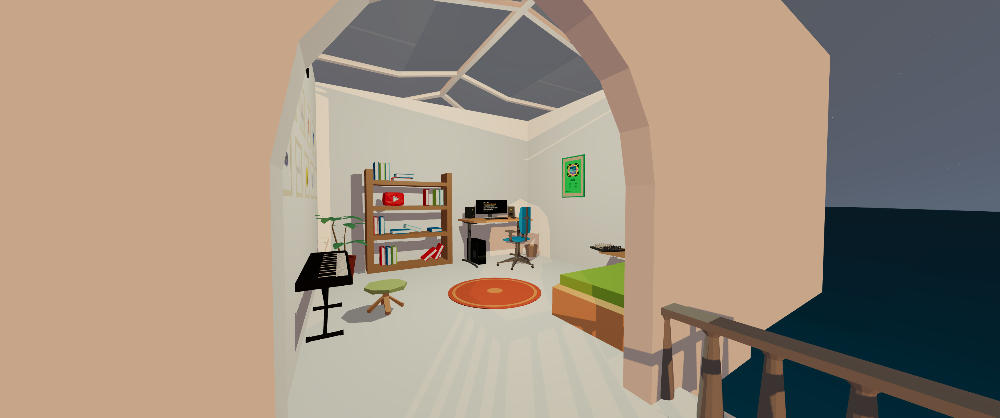

# First-person Portfolio

This project was created using React Drei, React Three.js, React Rapier, React Spring, and React Fiber.

In this project, you will find a 3D world where you can explore and interact with various models.

You can visit the live version of the project [here](https://gdmgent-2223-xr.github.io/fpp-michaelreinhard1/#/rapier/world).

## Screenshot

[](https://gdmgent-2223-xr.github.io/fpp-michaelreinhard1/#/rapier/world)

## Run Locally

Clone the project

```bash
  git clone https://github.com/gdmgent-2223-xr/fpp-michaelreinhard1
```

Go to the project directory

```bash
  cd fpp-michaelreinhard1
```

Install dependencies

```bash
  yarn
```

Start the server

```bash
  yarn start
```

## Credits

### Models

All models where created by except:

- [Lamp by Hac_Pc on Sketchfab](https://skfb.ly/opxAW)
- [Piano by manelzitos on Sketchfab](https://skfb.ly/oAMPt)
- [Plant by eucalyp555 on Sketchfab](https://skfb.ly/o6u8M)
- [Low Poly Keyboard by deduli657 on Sketchfab](https://skfb.ly/6Ypos)
- [Low Poly Chess Set by hanoldaa on Sketchfab](https://skfb.ly/6y8FI)
- [YouTube Diamond Play Button by ARS 3D on Sketchfab](https://skfb.ly/6XZrr)

### Music

All the music featured is original and created by me - [Xulo @xulobeats](https://www.instagram.com/xulobeats), except for:

- [Ocean Waves Soundscape by retox44 on YouTube](https://youtu.be/ieVPPZYvz7A)
- Sound effects from [Freesound](https://freesound.org) and [Mixkit](https://mixkit.co)

## Author

- [@michaelreinhard1](https://www.github.com/michaelreinhard1)
"# fpp" 
"# fpp" 
"# fpp" 
